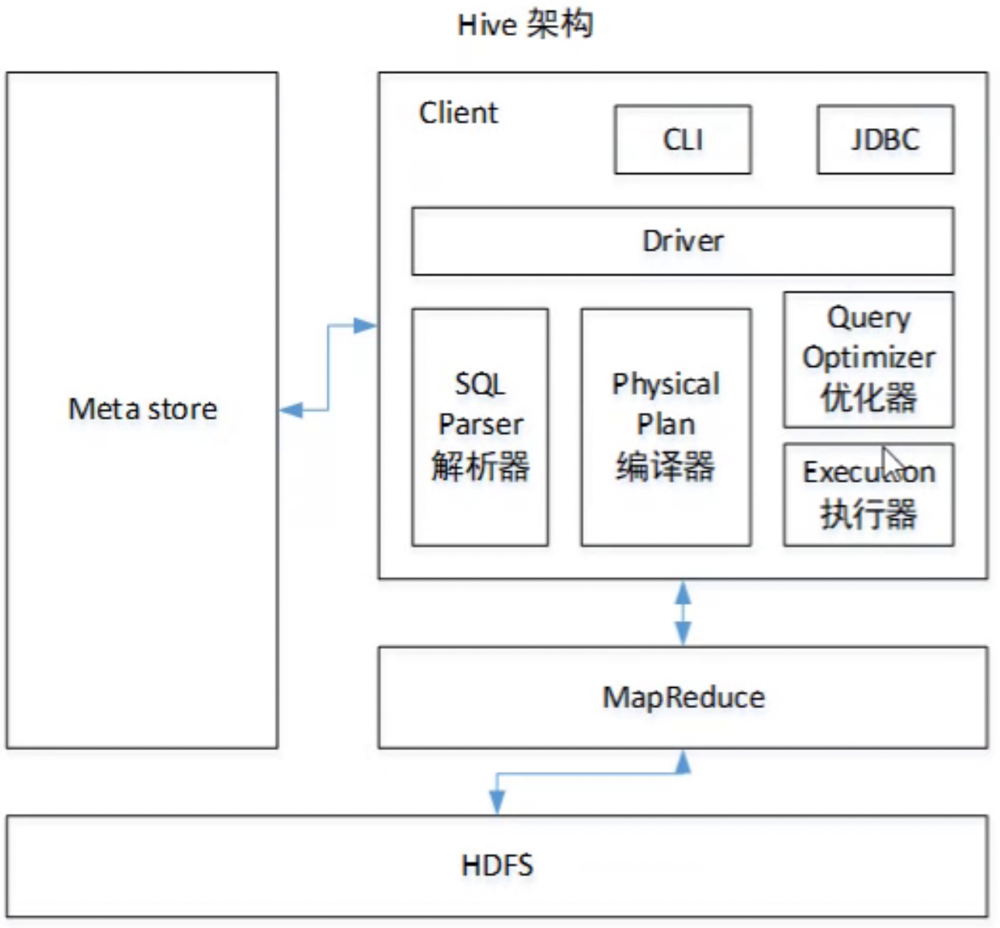

# Hive基本概念
## Hive 简介
Hive 是基于 Hadoop 的一个数据仓库工具，可以将结构化的数据文件映射为一张表，并提供类SQL查询功能。本质是将 HQL 转化成 MapReduce 程序。
1. Hive处理的数据存储在HDFS
2. Hive分析数据底层的实现是MapReduce
3. 执行程序运行在Yarn上

## Hive的特点
1.	操作接口采用类SQL语法，提供快速开发的能力（简单、容易上手）。避免了去写MapReduce，减少开发人员的学习成本。
2.	Hive的执行延迟比较高，因此Hive常用于数据分析，对实时性要求不高的场合。Hive优势在于处理大数据，对于处理小数据没有优势，因为Hive的执行延迟比较高。
3.	Hive支持用户自定义函数，用户可以根据自己的需求来实现自己的函数。
4.	迭代式算法无法表达。
5.	数据挖掘方面不擅长，由于MapReduce数据处理流程的限制，效率更高的算法却无法实现。
6.	Hive自动生成的MapReduce作业，通常情况下不够智能化。
7.	Hive调优比较困难，粒度较粗。

## Hive架构原理
Hive通过给用户提供的一系列交互接口，接收到用户的指令(SQL)，使用自己的Driver，结合元数据(MetaStore)，将这些指令翻译成MapReduce，提交到Hadoop中执行，最后，将执行返回的结果输出到用户交互接口。



1. 用户接口：Client
CLI（command-line interface）、JDBC/ODBC(jdbc访问hive)、WEBUI（浏览器访问hive）
2. 元数据：Metastore
元数据包括：表名、表所属的数据库（默认是default）、表的拥有者、列/分区字段、表的类型（是否是外部表）、表的数据所在目录等
3. Hadoop
使用HDFS进行存储，使用MapReduce进行计算。
4. 驱动器：Driver
	- 解析器（SQL Parser）：将SQL字符串转换成抽象语法树AST，这一步一般都用第三方工具库完成，比如antlr；对AST进行语法分析，比如表是否存在、字段是否存在、SQL语义是否有误。	
	- 编译器（Physical Plan）：将AST编译生成逻辑执行计划。
	- 优化器（Query Optimizer）：对逻辑执行计划进行优化。
	- 执行器（Execution）：把逻辑执行计划转换成可以运行的物理计划。对于Hive来说，就是MR/Spark。

## Hive和数据库比较
由于 Hive 采用了类似SQL 的查询语言 HQL(Hive Query Language)，因此很容易将 Hive 理解为数据库。其实从结构上来看，Hive 和数据库除了拥有类似的查询语言，再无类似之处。本文将从多个方面来阐述 Hive 和数据库的差异。数据库可以用在 Online 的应用中，但是Hive 是为数据仓库而设计的，清楚这一点，有助于从应用角度理解 Hive 的特性。
### 查询语言
由于SQL被广泛的应用在数据仓库中，因此，专门针对Hive的特性设计了类SQL的查询语言HQL。熟悉SQL开发的开发者可以很方便的使用Hive进行开发。
### 数据存储位置
Hive 是建立在 Hadoop 之上的，所有 Hive 的数据都是存储在 HDFS 中的。而数据库则可以将数据保存在块设备或者本地文件系统中。
### 数据更新
由于Hive是针对数据仓库应用设计的，而数据仓库的内容是读多写少的。因此，Hive中不建议对数据的改写，所有的数据都是在加载的时候确定好的。而数据库中的数据通常是需要经常进行修改的，因此可以使用 INSERT INTO …  VALUES 添加数据，使用 UPDATE … SET修改数据。
### 执行
Hive中大多数查询的执行是通过 Hadoop 提供的 MapReduce 来实现的。而数据库通常有自己的执行引擎。
### 执行延迟
Hive 在查询数据的时候，由于没有索引，需要扫描整个表，因此延迟较高。另外一个导致 Hive 执行延迟高的因素是 MapReduce框架。由于MapReduce 本身具有较高的延迟，因此在利用MapReduce 执行Hive查询时，也会有较高的延迟。相对的，数据库的执行延迟较低。当然，这个低是有条件的，即数据规模较小，当数据规模大到超过数据库的处理能力的时候，Hive的并行计算显然能体现出优势。
### 可扩展性
由于Hive是建立在Hadoop之上的，因此Hive的可扩展性是和Hadoop的可扩展性是一致的。而数据库由于 ACID 语义的严格限制，扩展行非常有限。目前最先进的并行数据库 Oracle 在理论上的扩展能力也只有100台左右。
### 数据规模
由于Hive建立在集群上并可以利用MapReduce进行并行计算，因此可以支持很大规模的数据；对应的，数据库可以支持的数据规模较小。

# DDL数据定义
## 创建数据库
```sql
CREATE DATABASE [IF NOT EXISTS] database_name
[COMMENT database_comment]
[LOCATION hdfs_path]
[WITH DBPROPERTIES (property_name=property_value, ...)];
```
1. 创建一个数据库，数据库在HDFS上的默认存储路径是```/user/hive/warehouse/*.db```
2. 避免要创建的数据库已经存在错误，增加``` if not exists```判断
3. 创建一个数据库，指定数据库在HDFS上存放的位置
```sql
create database db_hive location '/db_hive.db';
```

## 查询数据库
### 显示数据库
```sql
show databases;
```

### 查看数据库详情
1. 显示数据库信息
```sql
desc database db_hive;
```
2. 显示数据库详细信息
```sql
 desc database extended db_hive;
```

### 切换当前数据库
```sql
use db_hive;
```

## 修改数据库
用户可以使用ALTER DATABASE命令为某个数据库的DBPROPERTIES设置键-值对属性值，来描述这个数据库的属性信息。数据库的其他元数据信息都是不可更改的，包括数据库名和数据库所在的目录位置。
```sql
alter database db_hive set dbproperties('createtime'='20170830');
```

## 删除数据库
1. 删除空数据库
```sql
drop database db_hive;
```
2. 如果删除的数据库不存在，最好采用 if exists判断数据库是否存在
```sql
drop database if exists db_hive;
```
3. 如果数据库不为空，可以采用cascade命令，强制删除
```sql
drop database db_hive cascade;
```

## 创建表
```sql
CREATE [EXTERNAL] TABLE [IF NOT EXISTS] table_name 
[(col_name data_type [COMMENT col_comment], ...)] 
[COMMENT table_comment] 
[PARTITIONED BY (col_name data_type [COMMENT col_comment], ...)] 
[CLUSTERED BY (col_name, col_name, ...) 
[SORTED BY (col_name [ASC|DESC], ...)] INTO num_buckets BUCKETS] 
[ROW FORMAT row_format] 
[STORED AS file_format] 
[LOCATION hdfs_path]
[TBLPROPERTIES (property_name=property_value, ...)]
[AS select_statement]
```
1. CREATE TABLE 创建一个指定名字的表。如果相同名字的表已经存在，则抛出异常；用户可以用 IF NOT EXISTS 选项来忽略这个异常。
2. EXTERNAL关键字可以让用户创建一个外部表，在建表的同时可以指定一个指向实际数据的路径（LOCATION），在删除表的时候，内部表的元数据和数据会被一起删除，而外部表只删除元数据，不删除数据。
3. COMMENT：为表和列添加注释。
4. PARTITIONED BY创建分区表
5. CLUSTERED BY创建分桶表
6. SORTED BY不常用，对桶中的一个或多个列另外排序
7. 用户在建表的时候可以自定义SerDe或者使用自带的SerDe。如果没有指定ROW FORMAT 或者ROW FORMAT DELIMITED，将会使用自带的SerDe。在建表的时候，用户还需要为表指定列，用户在指定表的列的同时也会指定自定义的SerDe，Hive通过SerDe确定表的具体的列的数据。SerDe是Serialize/Deserilize的简称， hive使用Serde进行行对象的序列与反序列化。
```sql
ROW FORMAT 
DELIMITED [FIELDS TERMINATED BY char] [COLLECTION ITEMS TERMINATED BY char] [MAP KEYS TERMINATED BY char] [LINES TERMINATED BY char] 
| SERDE serde_name [WITH SERDEPROPERTIES (property_name=property_value, property_name=property_value, ...)]
```
8. STORED AS指定存储文件类型。常用的存储文件类型：SEQUENCEFILE（二进制序列文件）、TEXTFILE（文本）、RCFILE（列式存储格式文件）。如果文件数据是纯文本，可以使用STORED AS TEXTFILE。如果数据需要压缩，使用 STORED AS SEQUENCEFILE。
9. LOCATION ：指定表在HDFS上的存储位置。
10. AS：后跟查询语句，根据查询结果创建表。
11. LIKE允许用户复制现有的表结构，但是不复制数据。

### 查看表格式化数据
```sql
desc formatted table_name;
```

### 管理表
默认创建的表都是所谓的管理表，有时也被称为内部表。因为这种表，Hive会（或多或少地）控制着数据的生命周期。Hive默认情况下会将这些表的数据存储在由配置项hive.metastore.warehouse.dir(例如，/user/hive/warehouse)所定义的目录的子目录下。	当我们删除一个管理表时，Hive也会删除这个表中数据。管理表不适合和其他工具共享数据。

1. 普通创建表
```sql
create table if not exists student2(
id int, name string
)
row format delimited fields terminated by '\t'
stored as textfile
location '/user/hive/warehouse/student2';
```
2. 根据查询结果创建表（查询的结果会添加到新创建的表中）
```sql
create table if not exists student3 as select id, name from student;
```
3. 根据已经存在的表结构创建表
```sql
create table if not exists student4 like student;
```
### 外部表
因为表是外部表，所以Hive并非认为其完全拥有这份数据。删除该表并不会删除掉这份数据，不过描述表的元数据信息会被删除掉。

### 管理表与外部表的互相转换
修改内部表 table_name 为外部表
```sql
alter table table_name set tblproperties('EXTERNAL'='TRUE');
```
修改外部表 table_name 为内部表
```sql
alter table table_name set tblproperties('EXTERNAL'='FALSE');
```
注意：('EXTERNAL'='TRUE')和('EXTERNAL'='FALSE')为固定写法，区分大小写！

## 分区表
分区表实际上就是对应一个HDFS文件系统上的独立的文件夹，该文件夹下是该分区所有的数据文件。Hive中的分区就是分目录，把一个大的数据集根据业务需要分割成小的数据集。在查询时通过WHERE子句中的表达式选择查询所需要的指定的分区，这样的查询效率会提高很多。
### 创建分区表语法
```sql
create table dept_partition(
deptno int, dname string, loc string
)
partitioned by (month string)
row format delimited fields terminated by '\t';
```
### 加载数据到分区表中
```sql
load data local inpath '/opt/module/datas/dept.txt' into table table_name partition(month='201708');
```
### 查询分区表中数据
1. 单分区查询
```sql
select * from dept_partition where month='201709';
```
2. 多分区联合查询
```sql
select * from dept_partition where month='201709'
union
select * from dept_partition where month='201708'
union
select * from dept_partition where month='201707';
```
### 增加分区
1. 创建单个分区
```sql
alter table dept_partition add partition(month='201706');
```
2. 同时创建多个分区
```sql
alter table dept_partition add partition(month='201705') partition(month='201704');
```

### 删除分区
1. 删除单个分区
```sql
alter table dept_partition drop partition (month='201704');
```
2. 同时删除多个分区
```sql
alter table dept_partition drop partition (month='201705'), partition (month='201706');
```

### 查看分区表有多少分区
```sql
show partitions dept_partition;
```

### 查看分区表结构
```sql
desc formatted dept_partition;
```

### 创建二级分区表
```sql
create table dept_partition2(
 deptno int, dname string, loc string
 )
 partitioned by (month string, day string)
 row format delimited fields terminated by '\t';
```
### 加载数据到二级分区表中
```sql
load data local inpath '/datas/dept.txt' into table
 default.dept_partition2 partition(month='201709', day='13');
```
### 查询分区数据
```sql
select * from dept_partition2 where month='201709' and day='13';
```
### 把数据直接上传到分区目录上，让分区表和数据产生关联的三种方式
1. 执行修复命令
```sql
msck repair table dept_partition2;
```
2. 执行添加分区
```sql
alter table dept_partition2 add partition(month='201709',
 day='11');
```
3. 创建文件夹后load数据到分区

## 修改表
### 重命名表
```sql
ALTER TABLE table_name RENAME TO new_table_name
```
### 增加/修改/替换列信息
1. 更新列
```sql
ALTER TABLE table_name CHANGE [COLUMN] col_old_name col_new_name column_type [COMMENT col_comment] [FIRST|AFTER column_name]
```

2. 增加和替换列
```sql
ALTER TABLE table_name ADD|REPLACE COLUMNS (col_name data_type [COMMENT col_comment], ...) 
```
ADD 是代表新增一字段，字段位置在所有列后面(partition列前)，REPLACE则是表示替换表中所有字段。
```sql
alter table dept_partition add columns(deptdesc string);
```
```sql
alter table dept_partition replace columns(deptno string, dname
 string, loc string);
```

## 删除表
```sql
drop table dept_partition;
```

# DML数据操作
## 数据导入
### 向表中装载数据（Load）
```sql
load data [local] inpath path [overwrite] into table table_name [partition (partcol1=val1,…)];
```
1. load data: 表示加载数据
2. local: 表示从本地加载数据到 hive 表；否则从 HDFS 加载数据到 hive 表
3. inpath: 表示加载数据的路径
4. overwrite:表示覆盖表中已有数据，否则表示追加
5. into table: 表示加载到哪张表
6. student: 表示具体的表
7. partition:表示上传到指定分区

### 通过查询语句向表中插入数据（Insert）
1. 基本模式插入（根据单张表查询结果）
```sql
insert overwrite table student partition(month='201708')
select id, name from student where month='201709';
```
2. 多表（多分区）插入模式（根据多张表查询结果）
```sql
from student
insert overwrite table student partition(month='201707')
select id, name where month='201709'
insert overwrite table student partition(month='201706')
select id, name where month='201709';
```
insert into：以追加数据的方式插入到表或分区，原有数据不会删除
insert overwrite：会覆盖表或分区中已存在的数据
注意：insert不支持插入部分字段

### 查询语句中创建表并加载数据（As Select）
根据查询结果创建表（查询的结果会添加到新创建的表中）
```sql
create table if not exists student3 as select id, name from student;
```

### import数据到指定Hive表中
先用export导出后，再将数据导入。
```sql
import table student2 partition(month='201709') from export_path;
```

## 数据导出
### insert导出
1. 将查询的结果导出到本地
```sql
insert [OVERWRITE] local directory path select * from student;
```
2. 将查询的结果格式化导出到本地
```sql
insert overwrite local directory path
ROW FORMAT DELIMITED FIELDS TERMINATED BY '\t'             
select * from student;
```
3. 将查询的结果导出到HDFS上(没有local)
```sql
insert overwrite directory path
ROW FORMAT DELIMITED FIELDS TERMINATED BY '\t' 
select * from student;
```
### Hadoop命令导出到本地
```sql
dfs -get table_path path;
```
### Hive Shell 命令导出
```sql
bin/hive -e 'select * from default.student;' > path;
```
### Export导出到HDFS上
```sql
export table table_name to export_path;
```

### Sqoop导出

## 清除表中数据（Truncate）
```sql
truncate table student;
```
注意：Truncate只能删除管理表，不能删除外部表中数据

# 查询
```sql
[WITH CommonTableExpression (, CommonTableExpression)*] (Note: Only available starting with Hive 0.13.0)
SELECT [ALL | DISTINCT] select_expr, select_expr, ...
FROM table_reference
[WHERE where_condition]
[GROUP BY col_list]
[ORDER BY col_list]
[CLUSTER BY col_list | [DISTRIBUTE BY col_list] [SORT BY col_list]]
[LIMIT number]
```
1. SQL 语言大小写不敏感。
2. SQL 可以写在一行或者多行
3. 关键字不能被缩写也不能分行
4. 各子句一般要分行写
5. 使用缩进提高语句的可读性

##  Where语句
1. 使用WHERE子句，将不满足条件的行过滤掉
2. WHERE子句紧随FROM子句
3. where子句中不能使用字段别名
### 比较运算符（Between/In/ Is Null）

| 操作符                  | 支持的数据类型 | 描述                                                         |
| ----------------------- | -------------- | ------------------------------------------------------------ |
| A=B                     | 基本数据类型   | 如果A等于B则返回TRUE，反之返回FALSE                          |
| A<=>B                   | 基本数据类型   | 如果A和B都为NULL，则返回TRUE，其他的和等号（=）操作符的结果一致，如果任一为NULL则结果为NULL |
| A<>B, A!=B              | 基本数据类型   | A或者B为NULL则返回NULL；如果A不等于B，则返回TRUE，反之返回FALSE |
| A<B                     | 基本数据类型   | A或者B为NULL，则返回NULL；如果A小于B，则返回TRUE，反之返回FALSE |
| A<=B                    | 基本数据类型   | A或者B为NULL，则返回NULL；如果A小于等于B，则返回TRUE，反之返回FALSE |
| A>B                     | 基本数据类型   | A或者B为NULL，则返回NULL；如果A大于B，则返回TRUE，反之返回FALSE |
| A>=B                    | 基本数据类型   | A或者B为NULL，则返回NULL；如果A大于等于B，则返回TRUE，反之返回FALSE |
| A [NOT] BETWEEN B AND C | 基本数据类型   | 如果A，B或者C任一为NULL，则结果为NULL。如果A的值大于等于B而且小于或等于C，则结果为TRUE，反之为FALSE。如果使用NOT关键字则可达到相反的效果。 |
| A IS NULL               | 所有数据类型   | 如果A等于NULL，则返回TRUE，反之返回FALSE                     |
| A IS NOT NULL           | 所有数据类型   | 如果A不等于NULL，则返回TRUE，反之返回FALSE                   |
| IN(数值1, 数值2)        | 所有数据类型   | 使用 IN运算显示列表中的值                                    |
| A [NOT] LIKE B          | STRING 类型    | B是一个SQL下的简单正则表达式，也叫通配符模式。% 代表零个或多个字符(任意个字符；_ 代表一个字符。 |
| A RLIKE B, A REGEXP B   | STRING 类型    | _ 代表一个字符。B是基于java的正则表达式，如果A与其匹配，则返回TRUE；反之返回FALSE。匹配使用的是JDK中的正则表达式接口实现的，因为正则也依据其中的规则。例如，正则表达式必须和整个字符串A相匹配，而不是只需与其字符串匹配。 |

这些操作符同样可以用于 JOIN…ON 和 HAVING 语句中。

## 分组
### Group By语句
GROUP BY语句通常会和聚合函数一起使用，按照一个或者多个列队结果进行分组，然后对每个组执行聚合操作。
### Having语句
1. where 后面不能写分组函数，而 having 后面可以使用分组函数。
2. having 只用于 group by 分组统计语句。

## Join语句
### 等值Join
Hive支持通常的SQL JOIN语句，但是只支持等值连接，不支持非等值连接。
### 表的别名
1.  使用别名可以简化查询
2.  使用表名前缀可以提高执行效率
### 内连接
只有进行连接的两个表中都存在与连接条件相匹配的数据才会被保留下来。
### 左外连接
JOIN操作符左边表中符合WHERE子句的所有记录将会被返回。
### 右外连接
JOIN操作符右边表中符合WHERE子句的所有记录将会被返回。
### 满外连接
将会返回所有表中符合WHERE语句条件的所有记录。如果任一表的指定字段没有符合条件的值的话，那么就使用NULL值替代。
### 多表连接
连接 n个表，至少需要n-1个连接条件。例如：连接三个表，至少需要两个连接条件。
```sql
SELECT e.ename, d.dname, l.loc_name
FROM   emp e 
JOIN   dept d
ON     d.deptno = e.deptno 
JOIN   location l
ON     d.loc = l.loc;
```
大多数情况下，Hive会对每对JOIN连接对象启动一个MapReduce任务。本例中会首先启动一个MapReduce job对表e和表d进行连接操作，然后会再启动一个MapReduce job将第一个MapReduce job的输出和表l;进行连接操作。Hive总是按照从左到右的顺序执行的。

优化：当对3个或者更多表进行join连接时，如果每个on子句都使用相同的连接键的话，那么只会产生一个MapReduce job。
### 笛卡尔积
笛卡尔集会在下面条件下产生:
1. 省略连接条件
2. 连接条件无效
3. 所有表中的所有行互相连接
### 连接谓词中不支持or
hive join 目前不支持在on子句中使用谓词 or

## 排序
### Order By
全局排序，只有一个Reducer
1. ASC（ascend）: 升序（默认）
2. DESC（descend）: 降序
3. ORDER BY 子句在SELECT语句的结尾
4. 按照别名排序
5. 多个列排序
### Sort By
对于大规模的数据集order by的效率非常低。在很多情况下，并不需要全局排序，此时可以使用sort by。Sort by为每个reducer产生一个排序文件。每个Reducer内部进行排序，对全局结果集来说不是排序。
### Distribute By
在有些情况下，我们需要控制某个特定行应该到哪个reducer，通常是为了进行后续的聚集操作。distribute by 子句可以做这件事。distribute by类似MR中partition（自定义分区），进行分区，结合sort by使用。
1. distribute by的分区规则是根据分区字段的hash码与reduce的个数进行模除后，余数相同的分到一个区
2. Hive要求DISTRIBUTE BY语句要写在SORT BY语句之前
###  Cluster By
当distribute by和sorts by字段相同时，可以使用cluster by方式。cluster by除了具有distribute by的功能外还兼具sort by的功能。但是排序只能是升序排序，不能指定排序规则为ASC或者DESC。

## 分桶及抽样查询
分区提供一个隔离数据和优化查询的便利方式。不过，并非所有的数据集都可形成合理的分区。对于一张表或者分区，Hive 可以进一步组织成桶，也就是更为细粒度的数据范围划分。
1. 分区针对的是数据的存储路径；分桶针对的是数据文件。
2. 分桶是将数据集分解成更容易管理的若干部分的另一个技术。
3. 分桶规则：Hive的分桶采用对分桶字段的值进行哈希，然后除以桶的个数求余的方式决定该条记录存放在哪个桶当中。
### 分桶抽样查询
对于非常大的数据集，有时用户需要使用的是一个具有代表性的查询结果而不是全部结果。Hive可以通过对表进行抽样来满足这个需求。查询表stu_buck中的数据。
```sql
select * from stu_buck tablesample(bucket 1 out of 4 on id);
```
1. tablesample 是抽样语句，语法：TABLESAMPLE(BUCKET x OUT OF y) 。
2. y必须是table总bucket数的倍数或者因子。hive根据y的大小，决定抽样的比例。例如，table总共分了4份，当y=2时，抽取(4/2=)2个bucket的数据，当y=8时，抽取(4/8=)1/2个bucket的数据。
3. x表示从哪个bucket开始抽取，如果需要取多个分区，以后的分区号为当前分区号加上y。例如，table总bucket数为4，tablesample(bucket 1 out of 2)，表示总共抽取2（4/2）个bucket的数据，抽取第1(x)个和第3(x+y)个bucket的数据。
4. x的值必须小于等于y的值。

## 其他常用查询函数
### NVL
给值为NULL的数据赋值，它的格式是NVL( value，default_value)。它的功能是如果value为NULL，则NVL函数返回default_value的值，否则返回value的值，如果两个参数都为NULL ，则返回NULL。
### CASE WHEN
CASE 和 END 可以看成是语句开启和关闭的标识，WHEN 后面跟着条件，与其对应的 THEN 表示结果，最后一个条件结果用 ELSE 收尾。case when 的所谓多个条件就是 when 的多个条件，主要通过 AND 和 OR 关键字进行。case when 也可以进行嵌套组合。
```sql
CASE
  WHEN a THEN b
  WHEN c THEN d
  ELSE e 
END
```
求出不同部门男女各多少人
```sql
select 
  dept_id,
  sum(case sex when '男' then 1 else 0 end) male_count,
  sum(case sex when '女' then 1 else 0 end) female_count
from 
  emp_sex
group by
  dept_id;
```
以女子是否选择相亲的决策树为例
```sql
select
  CASE 
    WHEN age<30 THEN
      CASE 
        WHEN look = 'handsome' OR look = 'normal' THEN
          CASE 
            WHEN salary = 'high' THEN 'meeting'
            WHEN salary = 'low' THEN 'no meeting'
            ELSE
              CASE
                WHEN job = 'official' THEN 'meeting'
                ELSE 'no meeting'
              END
          END  
        ELSE 'no meeting'
      END
    ELSE 'no meeting'
  END
as meet_info
```
### 行转列
1. CONCAT(string A/col, string B/col…)：返回输入字符串连接后的结果，支持任意个输入字符串
2. CONCAT_WS(separator, str1, str2,...)：它是一个特殊形式的 CONCAT()。第一个参数剩余参数间的分隔符。分隔符可以是与剩余参数一样的字符串。如果分隔符是 NULL，返回值也将为 NULL。这个函数会跳过分隔符参数后的任何 NULL 和空字符串。分隔符将被加到被连接的字符串之间
3. COLLECT_SET(col)：函数只接受基本数据类型，它的主要作用是将某字段的值进行去重汇总，产生array类型字段
4. COLLECT_LIST(col)：函数只接受基本数据类型，它的主要作用是将某字段的值不去重汇总，产生array类型字段
```
name	constellation	blood_type
孙悟空	白羊座	A
大海	射手座	A
宋宋	白羊座	B
猪八戒	白羊座	A
凤姐	射手座	A
```
把星座和血型一样的人归类到一起。结果如下：
```
射手座,A            大海|凤姐
白羊座,A            孙悟空|猪八戒
白羊座,B            宋宋|苍老师
```
```sql
select
    concat(constellation, "," , blood_type) xx,
    concat_ws("|", collect_list(name)) name
from person_info
group by constellation, blood_type;
```
```sql
select
    concat_ws(",", constellation, blood_type) xx,
    concat_ws("|", collect_list(name)) name
from person_info
group by constellation, blood_type;
```

### 列转行
1. EXPLODE(col)：接收一个数组(或一个map)作为输入并将数组(map)的元素作为单独的行输出
2. LATERAL VIEW 用于和split、explode等UDTF一起使用的，能将一行数据拆分成多行数据，在此基础上可以对拆分的数据进行聚合，lateral view首先为原始表的每行调用UDTF，UDTF会把一行拆分成一行或者多行，lateral view在把结果组合，产生一个支持别名表的虚拟表。
	用法：LATERAL VIEW udtf(expression) tbl AS columnAlias
3. hive支持三种类型的UDF函数
	普通UDF函数：操作单个数据行，且产生一个数据作为输出。例如（数学函数，字符串函数）
	聚合udf （UDAF）：接受多个数据行，并产生一个数据行作为输出。例如（COUNT，MAX函数等）
	表生成UDF(UDTF)：接受一个数据行，然后返回产生多个数据行（一个表作为输出）
```
movie	category
《疑犯追踪》	悬疑,动作,科幻,剧情
《Lie to me》	悬疑,警匪,动作,心理,剧情
《战狼2》	战争,动作,灾难
```
将电影分类中的数组数据展开。结果如下：
```
《疑犯追踪》      悬疑
《疑犯追踪》      动作
《疑犯追踪》      科幻
《疑犯追踪》      剧情
《Lie to me》   悬疑
《Lie to me》   警匪
《Lie to me》   动作
《Lie to me》   心理
《Lie to me》   剧情
《战狼2》        战争
《战狼2》        动作
《战狼2》        灾难
```
```sql
select movie, category_name
from movie_info lateral 
view explode(split(category,',')) table_tmp as category_name;
```

### 窗口函数（开窗函数）
ROWS 必须跟在Order by 子句之后，对排序的结果进行限制，使用固定的行数来限制分区中的数据行数量。
1. OVER()：指定分析函数工作的数据窗口大小，这个数据窗口大小可能会随着行的变而变化。
2. CURRENT ROW：当前行
3. n PRECEDING：往前n行数据，n必须为int类型
4. n FOLLOWING：往后n行数据
5. UNBOUNDED：起点，UNBOUNDED PRECEDING 表示从前面的起点
6. UNBOUNDED FOLLOWING：表示到后面的终点
7. LAG(col,n,default_val)：往前第n行数据
8. LEAD(col,n, default_val)：往后第n行数据
9. NTILE(n)：把有序分区中的行分发到指定数据的组中，各个组有编号，编号从1开始，对于每一行，NTILE返回此行所属的组的编号。
```
name，orderdate，cost
jack,2017-01-01,10
tony,2017-01-02,15
jack,2017-02-03,23
tony,2017-01-04,29
```
```sql
elect name,orderdate,cost, 
sum(cost) over() as sample1,--所有行相加 
sum(cost) over(partition by name) as sample2,--按name分组，组内数据相加 
sum(cost) over(partition by name order by orderdate) as sample3,--按name分组，组内数据累加，每个顾客的cost按照日期进行累加
sum(cost) over(partition by name order by orderdate rows between UNBOUNDED PRECEDING and current row ) as sample4 ,--和sample3一样,由起点到当前行的聚合，每个顾客的cost按照日期进行累加
sum(cost) over(partition by name order by orderdate rows between 1 PRECEDING and current row) as sample5, --当前行和前面一行做聚合 
sum(cost) over(partition by name order by orderdate rows between 1 PRECEDING AND 1 FOLLOWING ) as sample6,--当前行和前边一行及后面一行 
sum(cost) over(partition by name order by orderdate rows between current row and UNBOUNDED FOLLOWING ) as sample7 --当前行及后面所有行 
from business;
```
查看顾客上次的购买时间
```sql
select name,orderdate,cost, 
lag(orderdate,1,'1900-01-01') over(partition by name order by orderdate )  time1
from business;
```
查询前20%时间的订单信息（按时间排序取 top 20%）
```sql
select * from (
    select name,orderdate,cost, ntile(5) over(order by orderdate) sorted
    from business
) t
where sorted = 1;
```

### Rank
1. RANK() 排序相同时会重复，总数不会变
2. DENSE_RANK() 排序相同时会重复，总数会减少
3. ROW_NUMBER() 会根据顺序计算


